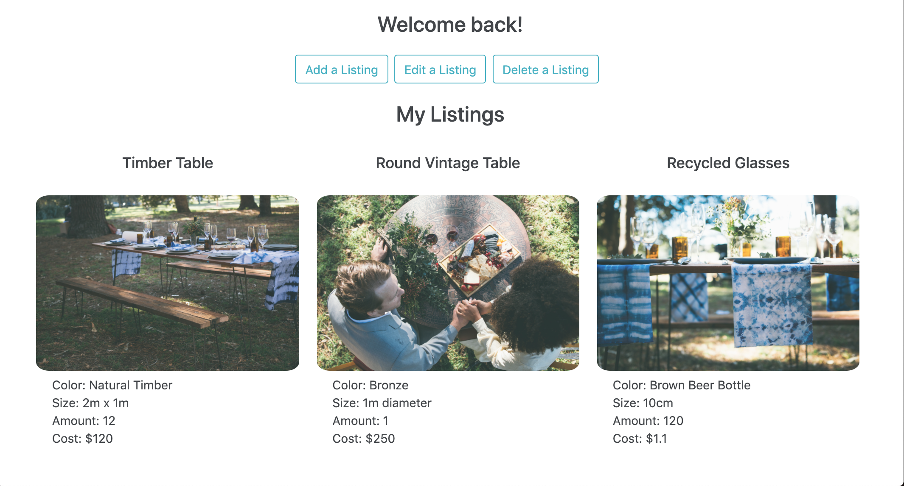

# Event-Hub

A working CRUD app for event planning/services/hire businesses, to keep track of inventory and current pricing, along with info on their own suppliers/cost to the business for each product. 

The app features a dashboard which shows current listings and the ability to either add a new listing or update/delete an existing one.

The remaining issues with the app:

The app has the ability to register a new user, however login functionality doesn't curently work.

Future plans:

I plan to add the option for each product/service to have a public-facing listing with availability calendars that are bookable in real time by clients, and a messaging platform between businesses and clients.

Install instructions:

Once cloned, start a terminal for both the client and server folders and run the "npm install" command in both to ensure you have the necessary dependencies. Then run the "npm start" command in both to start the servers, and this will open the app to http://localhost:3000

Built using MERN stack.
